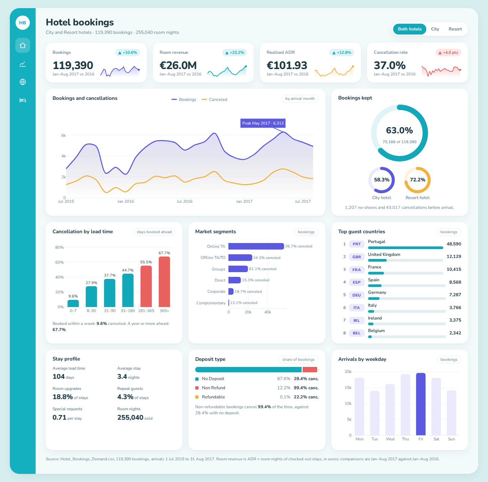
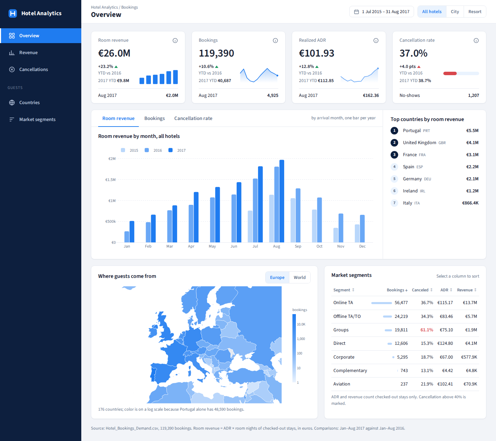
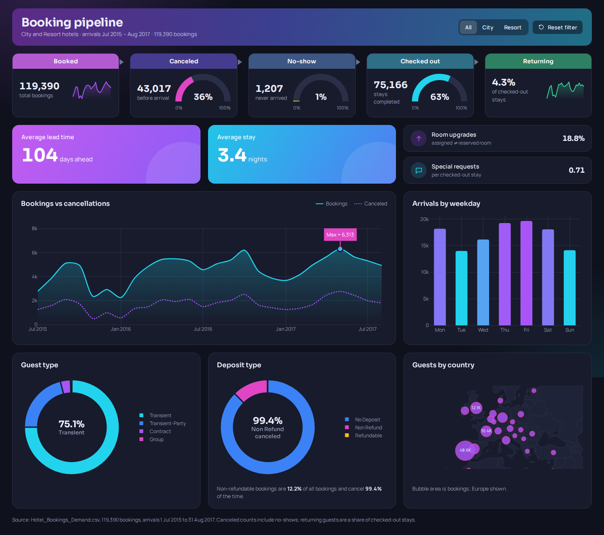

# Dashboard mockups

Three hand-built dashboards on the real `Hotel_Bookings_Demand.csv` (119,390 bookings), made as
the reference for the dashboard engine's next design system. They are **examples of what the
engine must be able to produce, not a menu of three**: the goal is any number of looks, and new
ones made from a spec or from a mockup like these.

| Mockup | Look | Shows |
|---|---|---|
| `lagoon` | pastel cards in a rounded app frame, icon rail; light and dark | KPI cards with year-on-year badge and sparkline, peak-annotated trend, kept-share rings, ranking list, stay facts, stacked share bar |
| `harbor` | admin console, navy sidebar, top filter bar; light and dark | KPI cards with mini chart and last-month footer, tabbed chart with one bar per year, ranking, map with Europe/World extent, sortable table |
| `nocturne` | dark gradient, banner header; dark only | five-stage pipeline strip with half gauges, gradient KPI tiles, dotted comparison line with a "Max =" callout, donuts with the answer in the centre, bubble map |





## What carries over to the engine

- **Plotly stays the chart engine.** The gap was never Plotly; it was styling, layout, sizing and
  alignment around it. Every chart in the engine is Plotly, the small ones too: sparklines, rings
  and gauges are drawn as SVG here only to get the mockups made, and become Plotly figures.
- **A look is data.** Each mockup's `:root` block is its token set (colors per theme, fonts,
  radius, shadow, spacing). Plotly reads the same tokens (`core.js` `baseLayout`) and re-renders
  when the theme changes, so a chart can never disagree with the page around it.
- **Layout is a preset, components are reusable:** frame with rail, sidebar console, banner;
  KPI card variants, stage strip, ranking list, sortable table, tabs, legend in the card header.
- **The numbers are defined once.** `build_data.py` states every metric (room revenue = ADR x
  room nights of checked-out stays, YTD = Jan-Aug 2017 against Jan-Aug 2016) and no panel sums a
  calendar field or an ID.
- **One file per dashboard.** Each built page inlines the server's own `plotly.min.js` and the
  world outline from `shared/geo`, and renders offline.

## Rebuild

```bash
python3 design/mockups/build_data.py /path/to/Hotel_Bookings_Demand.csv   # -> data.json (committed)
uv run python design/mockups/build.py                                     # -> build/*.html (ignored)
python3 design/mockups/shoot.py harbor                                    # -> build/shots/*.png
```

`build/` is not committed: each page is about 5 MB, nearly all of it the Plotly bundle, and is
rebuilt in a second from the files here.
